# Turnpenny-Fry Syndrome (PCGF2) Website

A Django full-stack web application designed to provide information, resources, and community features for those affected by Turnpenny-Fry Syndrome (PCGF2).
The site includes informational pages, a discussion forum,  and liked comment functionality for authencated users.

## How to View the Project

- [View the deployed website - turnpenny-fry-syndrome](https://turnpenny-fry-syndrome-98cd38841f84.herokuapp.com/)

## Table of Contents

- [About the Project](#about-the-project)
- [Technical information](#Technical-information)
    - [Installation](#installation)
    - [Usage](#usage)
- [Development](#development)
    - [Pre-production](#pre-production)

        -[User-Stories](#user-stories)

        -[Wireframes](#wireframes)
        
        -[ERD-Chart](#erd-chart)

    - [Production](#production)

- [Final Pages](#final-pages)
    -[Home](#home)
    -[About](#about)
    -[Forum](#forum)
    -[Post Detail Page](#post-detail-page)
    -[Profile](#profile)
    -[Edit and delete Pages](#edit-and-delete-pages)

- [Testing and Validation](#testing-and-validation)
    - [Unit Tests](#unit-tests)
    - [HTML Validation](#html-validation)
    - [CSS Validation](#css-validation)
    - [JS Validation](#js-validation)
    - [Lighthouse Tests](#lighthouse-tests)

- [Future Features](#future-features)
- [Credits](#credits)

## About the Project
The PCGF2 website was developed to create an online hub for individuals and families affected by Turnpenny-Fry Syndrome. It aims to:

- Provide accurate, accessible medical and community information.
- Foster interaction via a secure forum for families and people with PCGF2 and medical professionals.
- Enable registered users to share experiences, comment on posts, and ask questions.

The project is built using Django, following an MVC (Model-View-Controller) pattern, with HTML, CSS, and JavaScript for the frontend.

# Technical information

## Installation

1. Clone the repository

    ``git clone https://github.com/yourusername/pcgf2.git``

    ``cd pcgf2``

2. Create and activate a virtual environment

    ``python -m venv .venv``

    ``source .venv/bin/activate``   # Mac/Linux
    
    ``.venv\Scripts\activate``      # Windows

3. Install dependencies

    ``pip install -r requirements.txt``

4. Apply migrations

    ``python manage.py migrate``

5. Create a superuser

    ``python manage.py createsuperuser``

6. Run the development server

    ``python manage.py runserver``

## Usage

- Access the site at: `http://127.0.0.1:8000/`

- Register or log in to create and interact with forum posts.

- Use the Django admin panel at: `http://127.0.0.1:8000/admin/`

- Run all unit tests with: `python manage.py test`

# Development

## Pre-Production

#### User Stories:

For my intial planning I took and agile approach with staring out planning out user stories each with acceptance criteria and tasks to complete to reach my mvp and beyond.

Kanban board Screenshot

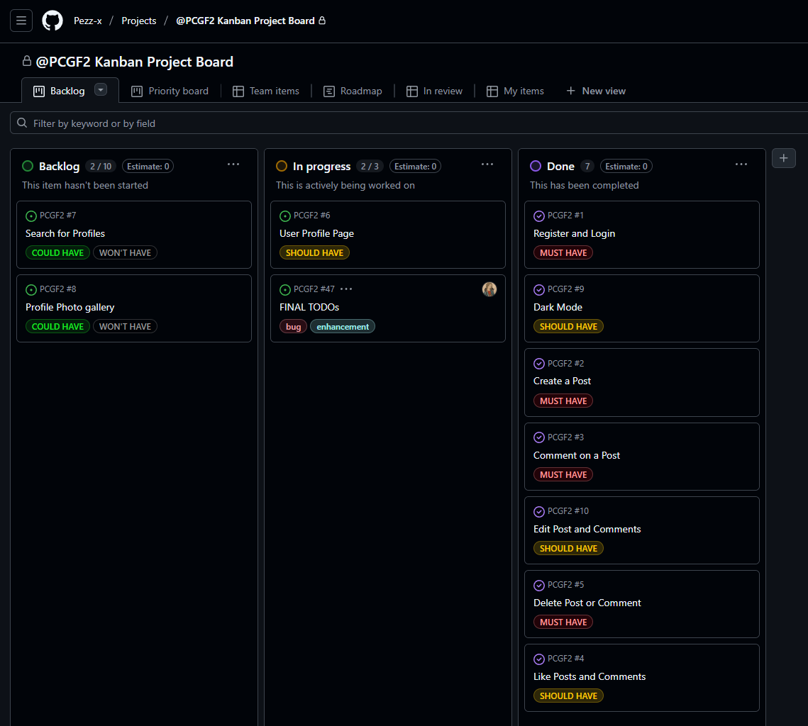

#

#### Wireframes:

Secondly I created the wireframes of what i wanted the rough layout to look using [Balsamiq](https://balsamiq.com/). I planned for the layout of Home, Forum, Profile , sign-in and sign out pages. The About page wasn't planned since I hadn't gathered the text that would be the content at the time, however I knew it would simply be mostly a block of information text on PCGF2.

Balsamiq wireframes

### Home Page
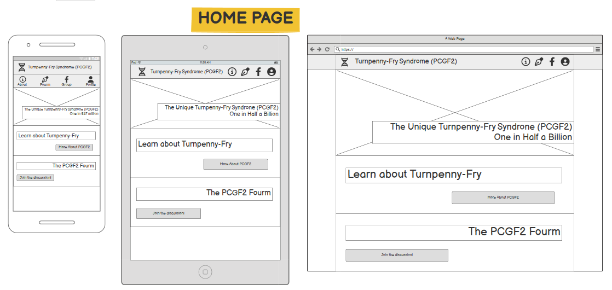

### Forum Page
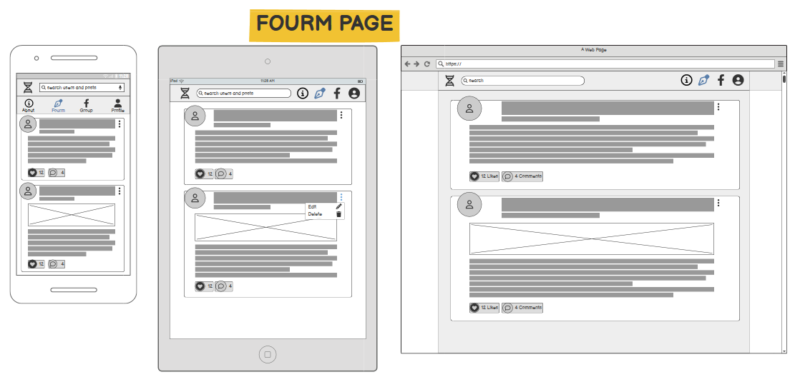

### Profile Page
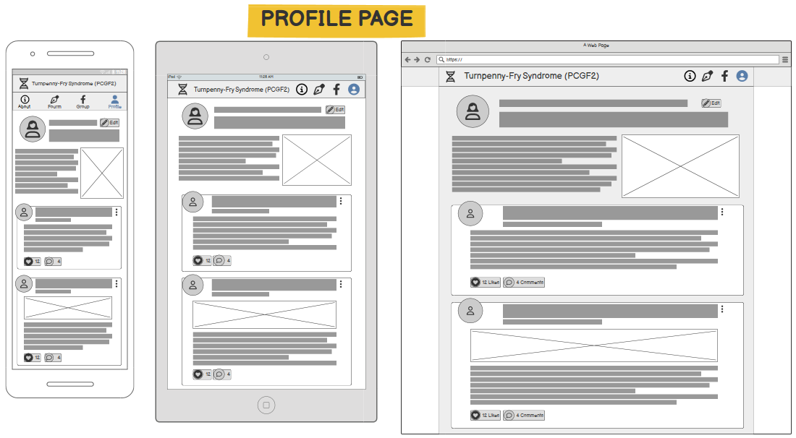

#

#### Colour Pallette

Colour palette was developed for both light and dark mode in mind and was adjusted to create suiable contrast for accessability.

Colour Palettes

### Light Mode colour palette
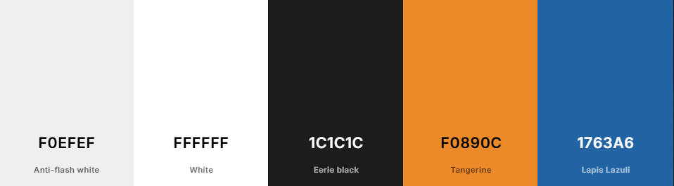

### Dark Mode colour palette
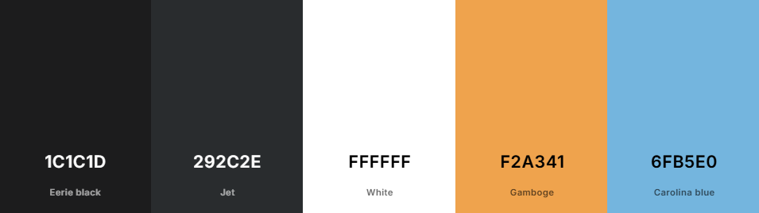

#

#### ERD Chart:

Final part of my pre-production was laying out my ERD with [Lucid Chart](https://www.lucidchart.com/)

ERD Chart

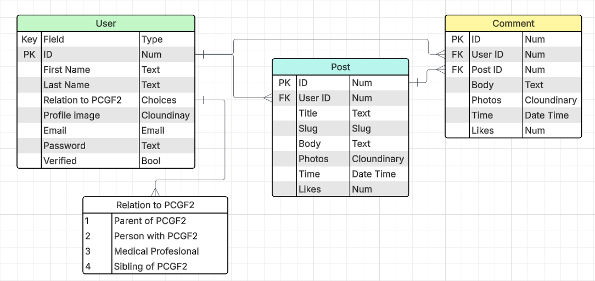

___

*Use of AI: Throughout all of the pre-production process NO AI was used.*

#

## Production

Writing of the code started off well with my intention of not using AI as much as possible, html pages and basic model, url and views files started off well till I came accross error codes I could'nt decypher then I would used Chat GPT to explain and work out error codes for me and susgest fixes without outright writing code for me.

By the end of week 2 I was running out of time and the error codes kept comming, every issiue I would fix would create 5 more and my site was just pages of 500 errors. So in the last few days of coding I decided to ignore developing the profile page and focus on the forum and CRUD functionaility without endless 500 errors.

Despite by despriate final sprint working with AI to fix my back end functionailty I'm happy to say that little to no AI was used in the front end development. HTML, CSS and JS was written entirely by me with Chat GPT fixing my silly django errors in my HTML when fixing my back-end.

## Final Pages

### Home

Home Page

### About

About Page

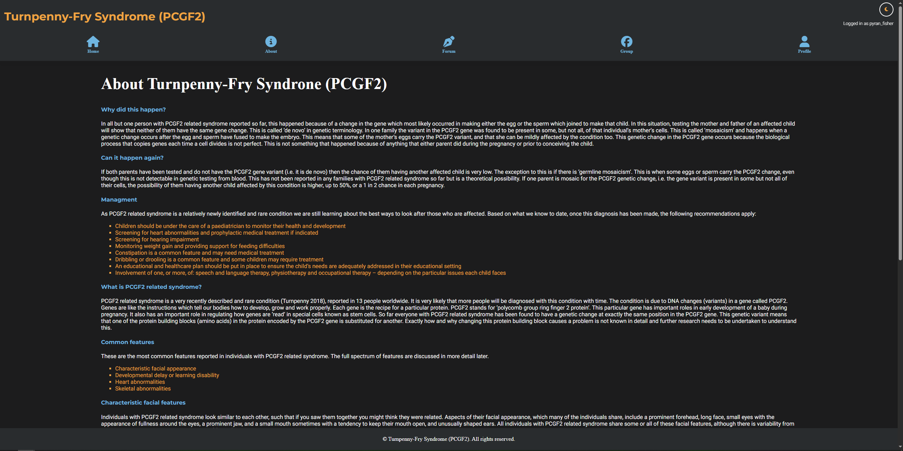

### Forum

Forum Page

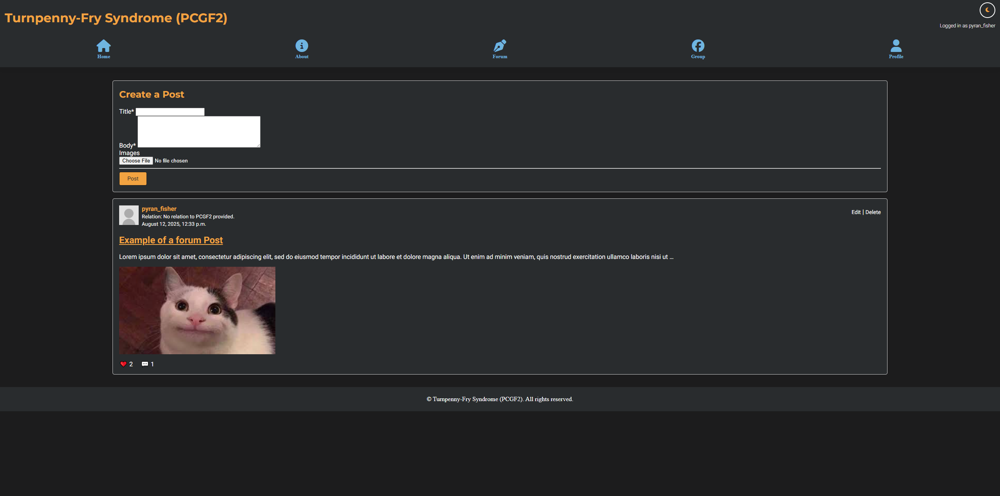

### Post Detail Page

Post Details Page

### Profile

Profile Page

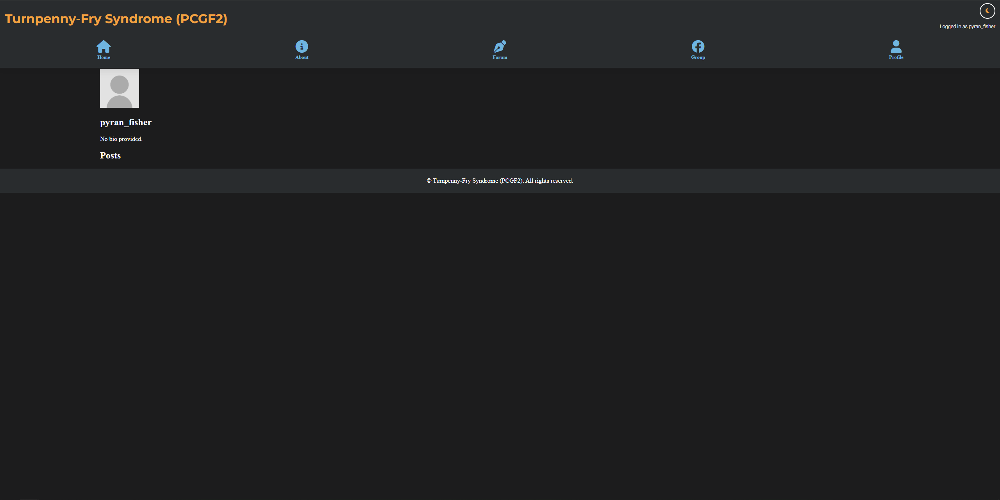

### Edit and delete Pages

Edit & Delete Page

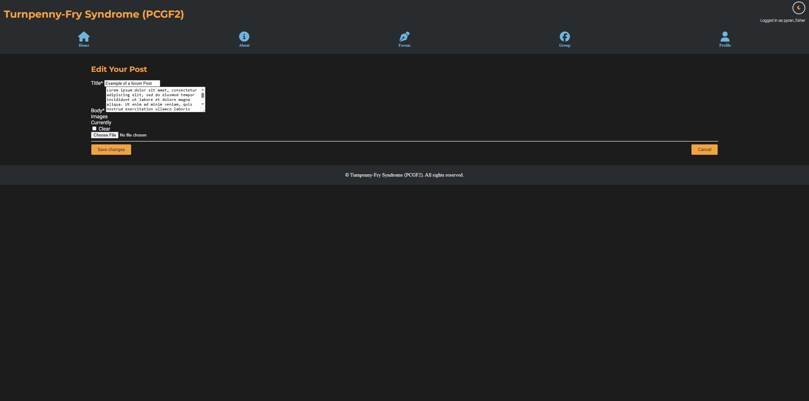

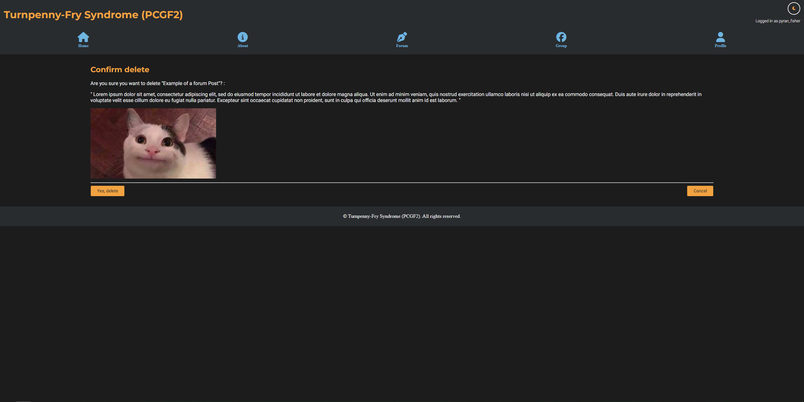

## Testing and Validation

### Unit Tests

Uint tests and results

    - Test 1 forum page loads for logged in user
    - Test 2 if logged in user can create posts
    - Test 3 if unlogged in user can create post
    - Test 4 if detail page for posts load with logged in user
    - Test 5 if logged in user can comment on detail page
    - Test 6 if unlogged in user can comment
    - Test 7 post like system
    - Test 8 comment like system
    - Test 9 if user can edit their own post
    - Test 10 if user can edit others posts
    - Test 11 if user can delete their own post
    - Test 12 if user can delete others posts
    - Test 13 if user can edit their own comment
    - Test 14 if user can edit others comments
    

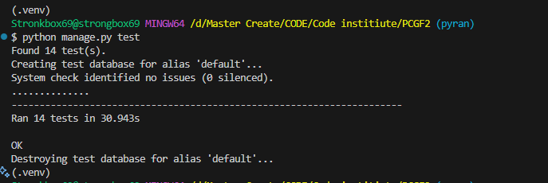

### HTML Validation

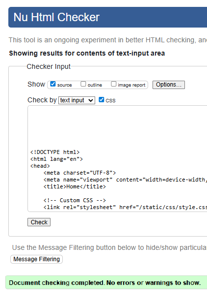

### CSS Validation

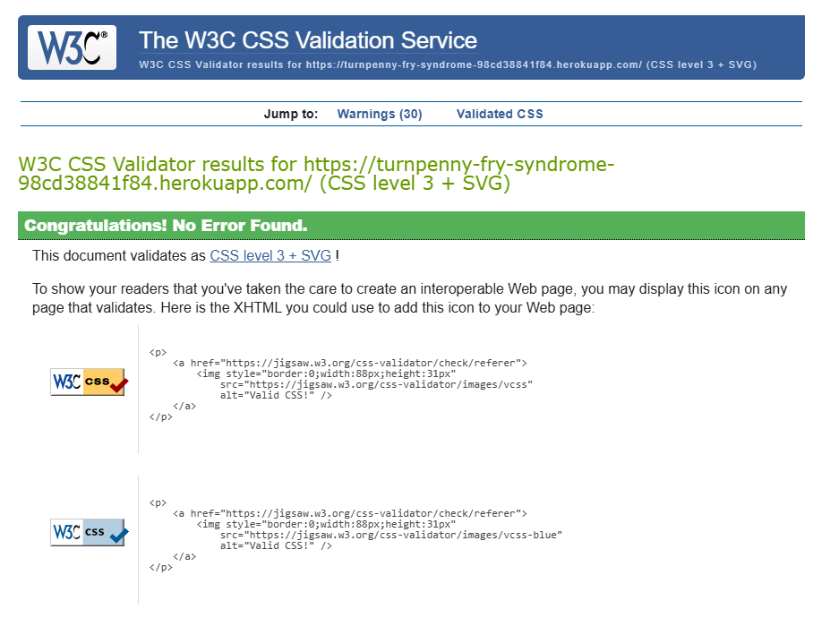

### Lighthouse Tests

Lighthouse tests do bring up errors but I didn't have the time to address them

Home page

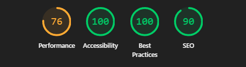

About page

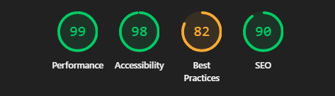

Forum page

Post details page

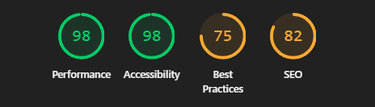

Profile page

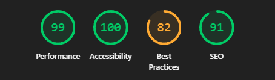

## Future Features
Due to my intial reluctance to use AI from the start of the project mainly for my own learning purposes, which I definely benifited from but it did slow production down. However here is a list of future features for me to work on if I ever get around to it:

- Compelete profile page
    - ability to add and edit:
        - profile picture
        - bio
        - relation to PCGF2 from drop down
    - Gallery of uploaded photos
    - Feed of users posts
- Ability to search on the forum for users and view their profile pages
- Ability to search on the forum for previous posts to see if simular issiues have been raised.
- Better pop ups for UX confimation
- Email notifications
- Ability to customise Fourm feed with filters and choose who to follow.

## Credits

- [Google Fonts](https://fonts.google.com/)
- [Django](https://www.djangoproject.com/)
- [Am I Responsive](https://ui.dev/amiresponsive)
- [Code Institute](https://codeinstitute.net/)
- [Chat GPT](https://chatgpt.com/) 
- [Lucid Chart](https://www.lucidchart.com/)
- [Balsamiq](https://balsamiq.com/)

